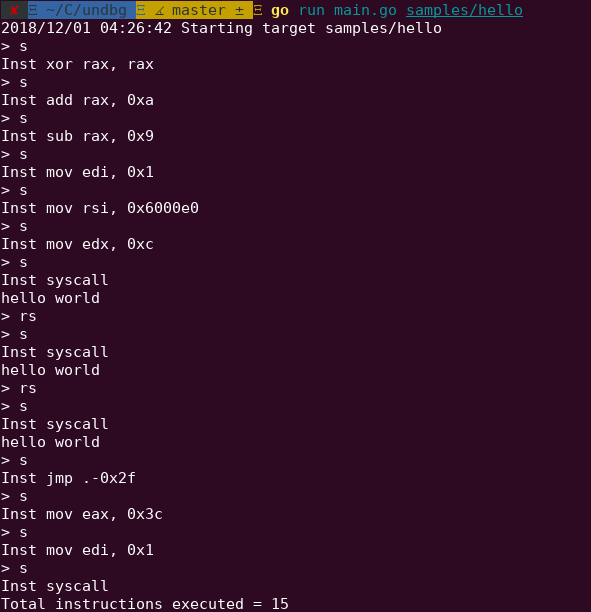

# undbg

undbg is an experimental debugger with support for reverse execution.

## Usage

    undbg <target program>

Currently, the only commands implemented are command `step` and `rev-step` (aliased to `s` and `rs`, respectively).

There is a sample program available in `samples/hello.asm`. You can use it to test undbg. To build the executable, run the following commands:

    nasm -felf64 samples/hello.asm -o samples/hello.o
    ld samples/hello.o -o samples/hello
    undbg ./samples/hello

Example undbg session:

As you can see, after reaching the `write` syscall instruction responsible for printing "Hello world", we reverse-step and step twice, resulting in "Hello world" being printed three times.

## Developing

Here, we assume you already have the Go toolchain installed.

After cloning the project, pull the git submodules:

    git submodule update --init --recursive
    cd undbg

We use [musl libc](https://www.musl-libc.org/) to generate a completely static binary. Usually, Go binaries are statically linked. However, undbg depends on the excellent [Zydis](https://zydis.re/) library, which is written in C. Because of this, we need to compile Zydis using musl to keep the final binary static.

You're going to need the `musl-gcc` binary available in PATH. To get it on Ubuntu, install the `musl-tools` package:

    sudo apt-get install -y musl-tools

For other distros, check the musl documentation.

Then, you need to compile Zydis:

    cd dependencies/zydis
    mkdir build
    cd build
    env CC="musl-gcc -static -Os -fPIC" cmake -D CMAKE_POSITION_INDEPENDENT_CODE=ON ..
    make

Now, you're ready to build undbg:

    cd ../../..
    env CC=$(which musl-gcc) go build -o undbg --ldflags '-linkmode external -extldflags "-static"' main.go
